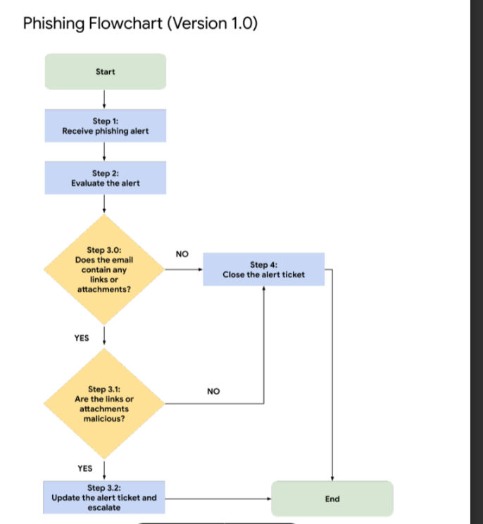

# Phishing Alert Investigation

## Overview

This project documents the investigation of a phishing alert involving a malicious email attachment sent to a human resources employee.

The investigation follows a phishing incident response playbook to evaluate the alert, identify indicators of compromise, determine the legitimacy of the threat, and decide whether escalation is required.

---

## Scenario

A phishing alert identified a suspicious email sent to the HR department. The email contained a password-protected executable attachment and originated from a suspicious sender address.

The attachment's SHA256 hash was identified as known malicious, requiring further investigation and escalation according to incident response procedures.

---

## Alert Summary

- Ticket ID: A-2703
- Severity: Medium
- Alert Type: Possible malware download
- Suspicious executable attachment detected
- Known malicious SHA256 hash identified
- Email targeted Human Resources personnel

---

## Investigation Areas

- Email analysis
- Sender verification
- Attachment review
- Threat intelligence validation
- Incident escalation procedures
- Playbook-driven response

---

## Key Findings

- The attachment was an executable file (`bfsvc.exe`)
- The SHA256 hash matched a known malicious file
- The sender address appeared suspicious
- The email contained grammatical irregularities
- The phishing attempt required escalation

---

## Visual Reference

---

## Repository Structure

- `alert-analysis.md`
- `phishing-investigation.md`
- `escalation-decision.md`
- `ticket-resolution.md`

Supporting documentation is available in the `docs/` directory.

---

## References

- [Alert Ticket](docs/alert-ticket.pdf)
- [Phishing Incident Response Playbook](docs/phishing-incident-response-playbook.pdf)
